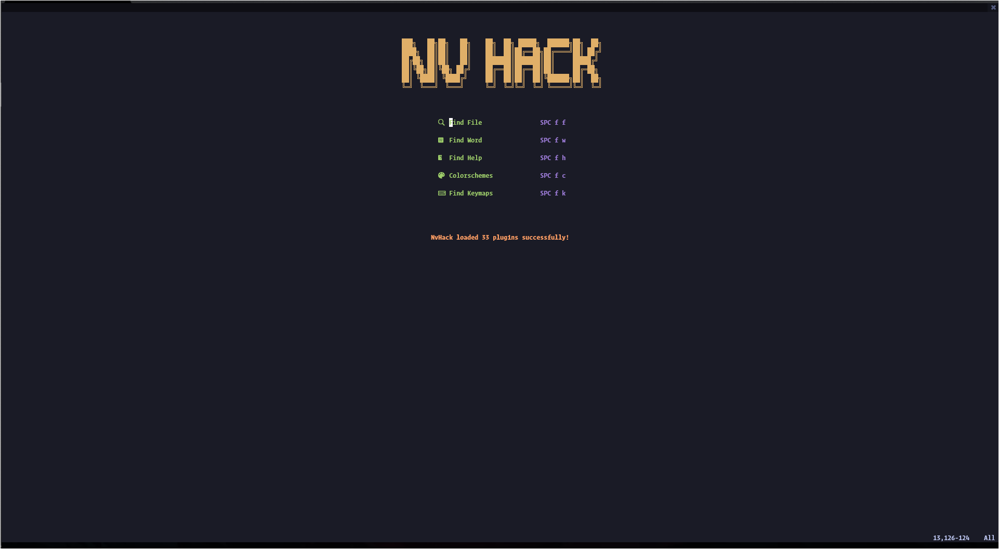
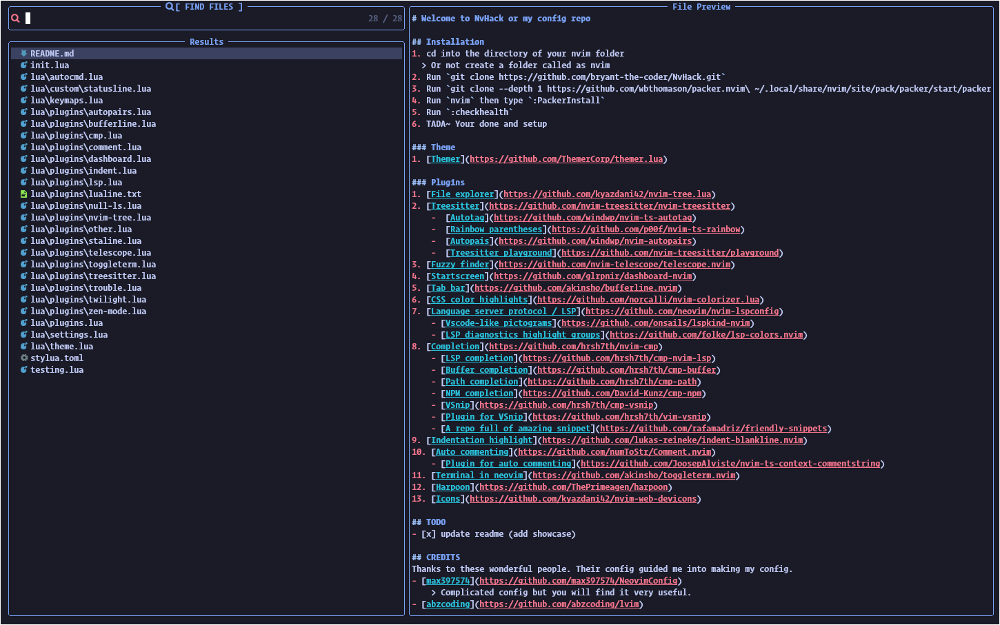
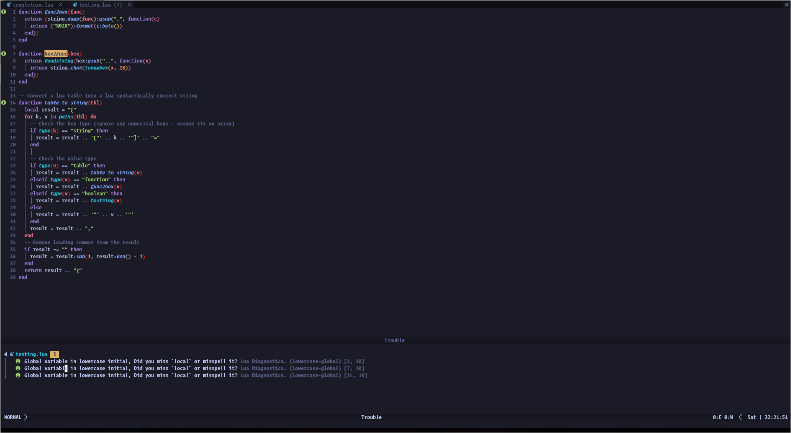

# Welcome to NvHack or my config repo

## Installation

1. cd into the directory of your nvim folder
   > Or not create a folder called as nvim
2. Run `git clone https://github.com/bryant-the-coder/NvHack.git`
3. Run `git clone https://github.com/wbthomason/packer.nvim "$env:LOCALAPPDATA\nvim-data\site\pack\packer\start\packer.nvim"` for windows users
   > `git clone --depth 1 https://github.com/wbthomason/packer.nvim\ ~/.local/share/nvim/site/pack/packer/start/packer.nvim` for unix users
4. Now run `nvim` and `:e lua/plugins.lua`
5. Then type `:source %` and run `:PackerSync`
6. Run `:checkhealth`
7. TADA~ Your done and setup

### Theme

1. [Themer](https://github.com/ThemerCorp/themer.lua)

### Plugins

1. [File explorer](https://github.com/kyazdani42/nvim-tree.lua)
2. [Treesitter](https://github.com/nvim-treesitter/nvim-treesitter)
   - [Autotag](https://github.com/windwp/nvim-ts-autotag)
   - [Rainbow parentheses](https://github.com/p00f/nvim-ts-rainbow)
   - [Autopais](https://github.com/windwp/nvim-autopairs)
   - [Treesitter playground](https://github.com/nvim-treesitter/playground)
3. [Fuzzy finder](https://github.com/nvim-telescope/telescope.nvim)
4. [Startscreen](https://github.com/glrpnir/dashboard-nvim)
5. [Tab bar](https://github.com/akinsho/bufferline.nvim)
6. [CSS color highlights](https://github.com/norcalli/nvim-colorizer.lua)
7. [Language server protocol / LSP](https://github.com/neovim/nvim-lspconfig)
   - [Vscode-like pictograms](https://github.com/onsails/lspkind-nvim)
   - [LSP diagnostics highlight groups](https://github.com/folke/lsp-colors.nvim)
8. [Completion](https://github.com/hrsh7th/nvim-cmp)
   - [LSP completion](https://github.com/hrsh7th/cmp-nvim-lsp)
   - [Buffer completion](https://github.com/hrsh7th/cmp-buffer)
   - [Path completion](https://github.com/hrsh7th/cmp-path)
   - [NPM completion](https://github.com/David-Kunz/cmp-npm)
   - [VSnip](https://github.com/hrsh7th/cmp-vsnip)
   - [Plugin for VSnip](https://github.com/hrsh7th/vim-vsnip)
   - [A repo full of amazing snippet](https://github.com/rafamadriz/friendly-snippets)
9. [Indentation highlight](https://github.com/lukas-reineke/indent-blankline.nvim)
10. [Auto commenting](https://github.com/numToStr/Comment.nvim)
    - [Plugin for auto commenting](https://github.com/JoosepAlviste/nvim-ts-context-commentstring)
11. [Terminal in neovim](https://github.com/akinsho/toggleterm.nvim)
12. [Harpoon](https://github.com/ThePrimeagen/harpoon)
13. [Icons](https://github.com/kyazdani42/nvim-web-devicons)

## showcase

Dashboard

Telescope

Trouble


## CREDITS

Thanks to these wonderful people. Their config guided me into making my config.

- [max397574](https://github.com/max397574/NeovimConfig)
  > Complicated config but you will find it very useful.
- [abzcoding](https://github.com/abzcoding/lvim)
  > amazing config. recommend to check it out.
- [tamton-aquib](https://github.com/tamton-aquib/nvim)
  > Remember to check his plugin. [staline](https://github.com/tamton-aquib/staline.nvim)
- [vsedov](https://github.com/vsedov/nvim)
- [tjdevseries](https://github.com/tjdevries/config_manager/tree/master/xdg_config/nvim)

```
nvim
├─ .git
├─ .gitattributes
├─ .github
├─ .gitignore
├─ init.lua
├─ lua
│  ├─ core
│  │  ├─ autocmd.lua
│  │  ├─ autocommand.lua
│  │  ├─ keymaps.lua
│  │  ├─ mappings.lua
│  │  ├─ settings.lua
│  │  ├─ theme.lua
│  │  └─ utils.lua
│  ├─ custom
│  │  ├─ highlights.lua
│  │  └─ statusline.lua
│  └─ plugins
│     ├─ config
│     │  ├─ alpha.lua
│     │  ├─ autopairs.lua
│     │  ├─ bufferline.lua
│     │  ├─ cmp.lua
│     │  ├─ comment.lua
│     │  ├─ dashboard.lua
│     │  ├─ gitsigns.lua
│     │  ├─ indent.lua
│     │  ├─ lsp
│     │  │  ├─ handlers.lua
│     │  │  ├─ init.lua
│     │  │  ├─ installer.lua
│     │  │  └─ settings
│     │  │     ├─ jsonls.lua
│     │  │     └─ sumneko_lua.lua
│     │  ├─ lualine.lua
│     │  ├─ neorg.lua
│     │  ├─ notify.lua
│     │  ├─ null-ls.lua
│     │  ├─ nvim-tree.lua
│     │  ├─ other.lua
│     │  ├─ snippets.lua
│     │  ├─ startup.lua
│     │  ├─ telescope.lua
│     │  ├─ toggleterm.lua
│     │  ├─ treesitter.lua
│     │  ├─ trouble.lua
│     │  ├─ twilight.lua
│     │  └─ zen-mode.lua
│     └─ plugins.lua
├─ README.md
├─ spell
│  ├─ en.utf-8.add
│  └─ en.utf-8.add.spl
├─ stylua.toml
├─ todos
│  ├─ inbox.norg
│  └─ index.norg
└─ utils
   └─ media
      ├─ cmp.png
      ├─ custom_statusline.png
      ├─ file_explorer.png
      ├─ lsp.png
      ├─ startscreen.png
      ├─ telescope.png
      └─ trouble.png

```
